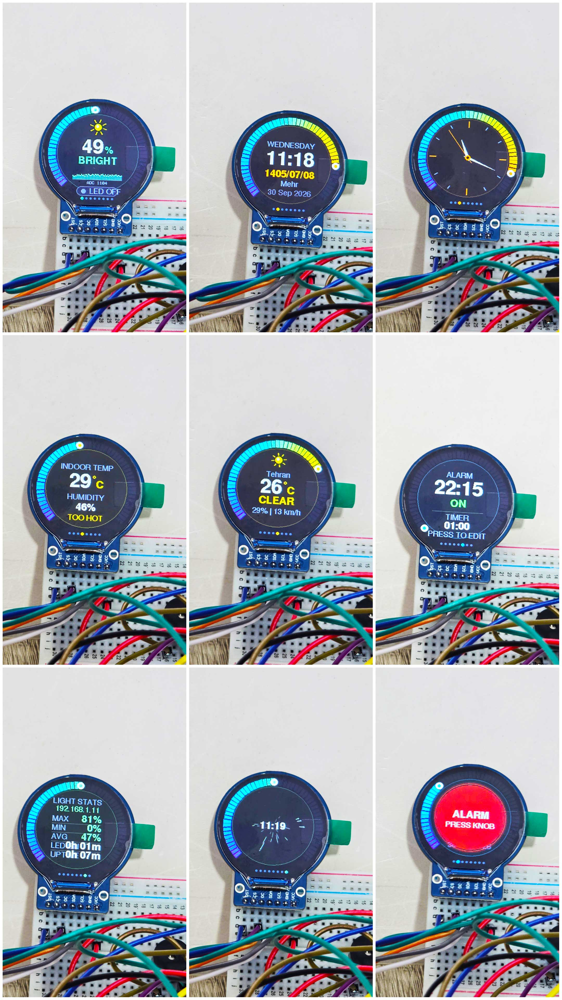
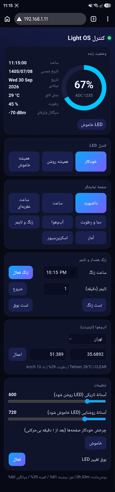

<div dir="rtl">

# Light OS - داشبورد هوشمند نور با ESP32

[English README](README.md)

یک وسیلهٔ رومیزی هوشمند با **ESP32** و یک **نمایشگر گرد ۲۴۰×۲۴۰ مدل GC9A01**.
شدت نور محیط را با LDR می‌سنجد و وقتی هوا تاریک شد LED را خودکار روشن می‌کند. همه‌چیز روی یک داشبورد گرد و روان نمایش داده می‌شود:
ساعت (با **تاریخ شمسی**)، دما و رطوبت اتاق، **آب‌وهوای بیرون**، **زنگ هشدار و تایمر**. با **موبایل** از طریق یک صفحهٔ وب داخلی کنترل می‌شود
و ناوبری روی خود دستگاه فقط با یک **انکودر (دکمهٔ چرخان)** انجام می‌شود.



*عکس ۸ صفحه روی دستگاه واقعی.*

> ▶ **[دیدن ویدیوی نمایشی در تلگرام](https://t.me/favme/2774)**

---

## فهرست

1. [امکانات](#امکانات)
2. [عکس‌ها و ویدیو](#عکسها-و-ویدیو)
3. [پیکربندی تست‌شده](#پیکربندی-تستشده)
4. [قطعات مورد نیاز](#قطعات-مورد-نیاز)
5. [سیم‌کشی](#سیمکشی)
6. [نصب نرم‌افزار قدم‌به‌قدم](#نصب-نرمافزار-قدمبهقدم)
7. [اولین روشن‌شدن و باز کردن صفحهٔ موبایل](#اولین-روشنشدن-و-باز-کردن-صفحهٔ-موبایل)
8. [طرز استفاده](#طرز-استفاده)
9. [تنظیمات](#تنظیمات)
10. [ساختار مخزن](#ساختار-مخزن)
11. [مشکلات رایج](#مشکلات-رایج)
12. [نکات امنیتی](#نکات-امنیتی)
13. [محدودیت‌ها و ایده‌ها](#محدودیتها-و-ایدهها)
14. [سازنده و تماس](#سازنده-و-تماس)
15. [مجوز و منابع](#مجوز-و-منابع)

---

## امکانات

**حس نور و LED**
- میانگین‌گیری از LDR و نمایش سطح نور ۰ تا ۱۰۰ درصد.
- LED خودکار با **هیسترزیس و زمان انتظار** (بدون چشمک): بعد از ۱.۴ ثانیه تاریکی روشن و بعد از ۱.۴ ثانیه روشنایی خاموش می‌شود.
- کنترل دستی از موبایل: خودکار / همیشه روشن / همیشه خاموش.
- آستانه‌های تاریکی و روشنایی از موبایل قابل تنظیم‌اند و ذخیره می‌شوند.
- بوق: ۲ بوق هنگام روشن‌شدن LED و ۱ بوق هنگام خاموش‌شدن (قابل بی‌صدا شدن).

**رابط گرد و بدون چشمک (۸ صفحه)**
- حلقهٔ گیج رنگی دور نمایشگر (۵۴ قطعه)، آیکون خورشید/ماه متحرک، نمودار تاریخچهٔ نور، وضعیت LED و انیمیشن موج هنگام تغییرات.
- صفحه‌ها: داشبورد، ساعت دیجیتال، ساعت عقربه‌ای، دما و رطوبت اتاق، آب‌وهوا، زنگ و تایمر، آمار (با آدرس IP)، اسکرین‌سیور ستاره‌ای.

**ساعت و تاریخ**
- ساعت از اینترنت (NTP) گرفته می‌شود؛ ماژول RTC لازم نیست. منطقهٔ زمانی پیش‌فرض ایران (UTC+3:30 بدون ساعت تابستانی).
- **تاریخ شمسی** کنار تاریخ میلادی.

**محیط**
- دما و رطوبت اتاق با DHT11 (همراه با برچسب «راحتی»).
- آب‌وهوای بیرون از [Open-Meteo](https://open-meteo.com) (بدون نیاز به کلید API): دما، شرایط جوی با آیکون، رطوبت و باد. شهر از صفحهٔ موبایل انتخاب می‌شود.

**زنگ هشدار و تایمر**
- زنگ روزانه و تایمر معکوس (۱ تا ۹۹ دقیقه)، قابل تنظیم با انکودر روی دستگاه **یا** از موبایل.
- هنگام زنگ زدن، صفحهٔ چشمک‌زن قرمز و بوق تکراری؛ با فشردن انکودر یا از موبایل قطع می‌شود.

**کنترل با موبایل**
- آدرس `http://lightos.local` (یا IP دستگاه) را در همان Wi-Fi باز کنید.
- نمایش زندهٔ نور، دما، رطوبت، ساعت و LED؛ تغییر حالت LED، انتخاب صفحه، تنظیم زنگ و تایمر، انتخاب شهر، تنظیم آستانه‌ها، چرخش خودکار و بوق.
- رابط **دوزبانه (فارسی و انگلیسی)** است با دکمهٔ تغییر زبان (انتخاب شما در مرورگر ذخیره می‌شود؛ فارسی راست‌به‌چپ نمایش داده می‌شود)، مناسب موبایل و بدون نیاز به کتابخانه یا اینترنت بیرونی.
- یک API ساده با خروجی JSON هم دارد: [docs/web-api.md](docs/web-api.md)

**حالت بیکار هوشمند**
- اگر ۱ دقیقه نور تغییر نکند و به انکودر یا موبایل دست نخورد، صفحه‌ها خودکار می‌چرخند: ساعت، دما، آب‌وهوا، ساعت عقربه‌ای، آمار، ستاره‌ها.
- تغییر ناگهانی نور، تغییر LED، دست زدن به انکودر، زنگ یا انتخاب صفحه از موبایل دوباره داشبورد را می‌آورد.

**ذخیرهٔ تنظیمات**
- آستانه‌ها، حالت LED، زنگ، تایمر، بی‌صدا، چرخش خودکار و شهر آب‌وهوا بعد از قطع برق هم می‌مانند.

---

## عکس‌ها و ویدیو

### ویدیوی نمایشی

[](https://t.me/favme/2774)

▶ **[دیدن ویدیوی نمایشی در تلگرام](https://t.me/favme/2774)** (در تلگرام یا Telegram Web باز می‌شود)

### صفحهٔ کنترل با موبایل (فارسی و انگلیسی)

| فارسی | English |
|---|---|
|  |  |

### تصویر گرافیکی ۸ صفحه


*این تصویر آخر یک شبیه‌سازی گرافیکی است (نه عکس) که هر صفحه را با اسمش نشان می‌دهد: ۰ داشبورد، ۱ ساعت دیجیتال، ۲ ساعت عقربه‌ای، ۳ دما و رطوبت، ۴ آب‌وهوا، ۵ زنگ و تایمر، ۶ آمار + IP، ۷ اسکرین‌سیور ستاره‌ای.*

---

## پیکربندی تست‌شده

این پروژه روی **سخت‌افزار واقعی ساخته و تست شده** است (برنامهٔ اصلی و هر دو برنامهٔ نمونه بدون مشکل اجرا شدند):

| مورد | مشخصات تست |
|---|---|
| برد | **ESP32 DevKit ‏۳۸ پایه**، تراشهٔ ESP32-D، مبدل USB مدل **CP210x** (CP2102) |
| نمایشگر | GC9A01 ‏۱.۲۸ اینچ گرد ۲۴۰×۲۴۰، ماژول ۷ پایهٔ SPI |
| قطعات | LDR + مقاومت ۱۰k، LED + مقاومت ۲۲۰، بیزر اکتیو، انکودر KY-040، ماژول DHT11 |
| کامپیوتر / نرم‌افزار | ویندوز، Arduino IDE 2.x |
| بستهٔ برد ESP32 | بستهٔ **esp32** از Espressif از طریق Boards Manager (شمارهٔ دقیق نسخه ثبت نشده) |
| کتابخانه‌ها | **آخرین نسخه‌های** موجود در Library Manager در زمان تست (سپتامبر ۲۰۲۶): Adafruit GFX Library، Adafruit GC9A01A (نسخهٔ پیشنهادی ۱.۱.۱ بود) و DHT sensor library |
| برنامه‌های تست‌شده | `light_os` (برنامهٔ اصلی)، `hardware_selftest`، `wifi_time_test` |

بردهای ESP32 DevKit ‏۳۰ پایه با همان شمارهٔ GPIO‌ها باید کار کنند ولی تست نشده‌اند. اگر نسخهٔ جدیدتری از کتابخانه یا بستهٔ برد کامپایل را خراب کرد،
لطفاً با ذکر نسخه‌ها یک issue باز کنید.

---

## قطعات مورد نیاز

| تعداد | قطعه | توضیح |
|---|---|---|
| ۱ | برد ESP32 (خانوادهٔ ESP32-WROOM-32) | تست‌شده روی **DevKit ‏۳۸ پایه با تراشهٔ USB مدل CP2102**. نسخهٔ ۳۰ پایه هم باید کار کند (شمارهٔ GPIO یکی است) ولی تست نشده؛ برچسب پایه‌ها ممکن است کمی فرق کند |
| ۱ | نمایشگر گرد GC9A01 ‏۱.۲۸ اینچ ۲۴۰×۲۴۰ SPI | ماژول ۷ پایه: RST, CS, DC, SDA, SCL, GND, VCC |
| ۱ | LDR (مقاومت نوری) | مثلاً GL5528 |
| ۱ | مقاومت ۱۰ کیلواهم | تقسیم ولتاژ LDR |
| ۱ | LED + مقاومت ۲۲۰ اهم | |
| ۱ | بیزر **اکتیو** (۳.۳ تا ۵ ولت) | اکتیو یعنی خودش صدا تولید می‌کند |
| ۱ | ماژول انکودر KY-040 | ۵ پایه: CLK, DT, SW, +, GND |
| ۱ | ماژول DHT11 (سه‌پایه) | با مقاومت pull-up روی برد |
| - | بردبورد، سیم جامپر، کابل USB **دیتا** | کابل فقط‌شارژ کار نمی‌کند |

فهرست کامل با جایگزین‌ها: [docs/bom.md](docs/bom.md)

---

## سیم‌کشی

**همهٔ قطعات از پایهٔ `3V3` برد تغذیه می‌شوند. هیچ قطعه‌ای را به 5V وصل نکنید.**

| کاربرد | پایهٔ ماژول | پایهٔ ESP32 |
|---|---|---|
| کلاک نمایشگر | SCL | **GPIO18** |
| داده نمایشگر | SDA | **GPIO23** |
| انتخاب تراشهٔ نمایشگر | CS | **GPIO5** |
| داده/دستور نمایشگر | DC | **GPIO2** |
| ریست نمایشگر | RST | **GPIO15** |
| تغذیهٔ نمایشگر | VCC / GND | 3V3 / GND |
| سنسور نور (نقطهٔ وسط LDR و ۱۰k) | - | **GPIO34** |
| LED (آند از طریق مقاومت ۲۲۰ به GND) | - | **GPIO16** |
| بیزر (+) | - | **GPIO17** |
| انکودر: CLK | CLK | **GPIO32** |
| انکودر: DT | DT | **GPIO33** |
| انکودر: دکمه | SW | **GPIO25** |
| تغذیهٔ انکودر | + / GND | 3V3 / GND |
| داده DHT11 | S / OUT | **GPIO27** |
| تغذیهٔ DHT11 | VCC / GND | 3V3 / GND |


نکات مهم:
- روی نمایشگر، «SDA» و «SCL» اسم پایه‌های **SPI** هستند، نه I2C.
- پایهٔ `+` انکودر را حتماً به **3V3** بزنید.
- ترتیب پایه‌های DHT11 در ماژول‌های مختلف فرق دارد؛ نوشته‌های روی برد را بخوانید. برعکس وصل‌کردن `+` و `-` سنسور را می‌سوزاند.
- LDR باید روی **GPIO34** باشد (نه GPIO4)، چون وقتی Wi-Fi روشن است پایه‌های ADC2 آنالوگ نمی‌خوانند.

راهنمای کامل سیم‌کشی، دیاگرام هر ماژول، ترتیب مونتاژ و چک‌لیست: **[docs/wiring.md](docs/wiring.md)**

> پیشنهاد: قبل از برنامهٔ اصلی، برنامهٔ [تست سخت‌افزار](firmware/examples/hardware_selftest/hardware_selftest.ino) را آپلود کنید.
> نمایشگر، LED، بیزر، LDR، DHT11 و انکودر را یکی‌یکی امتحان می‌کند.

---

## نصب نرم‌افزار قدم‌به‌قدم

### ۱. نصب Arduino IDE و بستهٔ ESP32
1. **Arduino IDE 2.x** را از <https://www.arduino.cc/en/software> نصب کنید.
2. از *File → Preferences* این آدرس را در **Additional boards manager URLs** بگذارید:
   `https://espressif.github.io/arduino-esp32/package_esp32_index.json`
3. از *Tools → Board → Boards Manager* عبارت **esp32** (از Espressif Systems) را جستجو و نصب کنید.
4. برد را انتخاب کنید: *Tools → Board → esp32 → **ESP32 Dev Module***.

### ۲. نصب کتابخانه‌ها
از *Tools → Manage Libraries* این‌ها را نصب کنید:

| کتابخانه | سازنده |
|---|---|
| **Adafruit GFX Library** | Adafruit |
| **Adafruit GC9A01A** | Adafruit |
| **DHT sensor library** | Adafruit |
| Adafruit BusIO و Adafruit Unified Sensor | Adafruit (به‌عنوان وابستگی؛ روی «Install all» بزنید) |

کتابخانه‌های Wi-Fi، وب‌سرور، mDNS، ذخیرهٔ تنظیمات و زمان **داخل بستهٔ ESP32 هستند** و نیازی به نصب ندارند.
جزئیات بیشتر: [docs/libraries.md](docs/libraries.md)

> اگر هنگام نصب کتابخانه در ویندوز خطای `creating temp dir ... Documents\Arduino\libraries` دیدید، پوشهٔ
> `Documents\Arduino\libraries` را خودتان بسازید و دوباره نصب کنید.

### ۳. دریافت کد
```bash
git clone https://github.com/mehrdad2200/LightOS-ESP32.git
```
یا در GitHub روی **Code → Download ZIP** بزنید و از حالت فشرده خارج کنید.

### ۴. نام و رمز Wi-Fi
داخل پوشهٔ `firmware/light_os/`:
1. فایل `secrets.h.example` را کپی کنید و اسم کپی را **`secrets.h`** بگذارید.
2. آن را ویرایش کنید:
   ```cpp
   const char *WIFI_SSID = "نام-وای‌فای";
   const char *WIFI_PASS = "رمز-وای‌فای";
   ```
فایل `secrets.h` در `.gitignore` است و رمز شما به GitHub نمی‌رود. ESP32 فقط شبکهٔ **۲.۴ گیگاهرتز** را پشتیبانی می‌کند.

### ۵. (اختیاری) منطقهٔ زمانی و شهر
پیش‌فرض‌ها ساعت ایران و آب‌وهوای تهران است. شهر را از صفحهٔ موبایل عوض می‌کنید و منطقهٔ زمانی را در کد ([docs/configuration.md](docs/configuration.md)).

### ۶. آپلود
1. فایل `firmware/light_os/light_os.ino` را باز کنید (اسم پوشه با اسم فایل یکی است).
2. برد را با کابل USB **دیتا** وصل کنید و پورت را انتخاب کنید (*Tools → Port*).
3. اگر «Sketch too big» آمد: *Tools → Partition Scheme → **Huge APP (3MB No OTA/1MB SPIFFS)***.
4. **Upload** را بزنید. اگر پیام «Connecting...» ماند، دکمهٔ **BOOT** برد را نگه دارید تا آپلود شروع شود.
5. Serial Monitor را روی **115200** باز کنید.

---

## اولین روشن‌شدن و باز کردن صفحهٔ موبایل

1. یک انیمیشن کوتاه شروع پخش می‌شود و بعد داشبورد می‌آید.
2. Serial Monitor آدرس را چاپ می‌کند، مثلاً `Web control: http://192.168.1.42  (or http://lightos.local)`.
   همین IP روی خود نمایشگر هم در صفحهٔ **آمار** (صفحهٔ ۶) نوشته می‌شود.
3. موبایل را به **همان Wi-Fi** وصل کنید و آن آدرس را در مرورگر بزنید.
4. ساعت چند ثانیه «SYNCING» نشان می‌دهد تا زمان از اینترنت برسد.
5. صفحهٔ آب‌وهوا تا اولین دانلود موفق «LOADING...» نشان می‌دهد.

آدرس `lightos.local` روی بیشتر آیفون‌ها و کامپیوترها کار می‌کند؛ بعضی گوشی‌های اندروید `.local` را نمی‌شناسند و باید از IP استفاده کنند.

---

## طرز استفاده

| کار با انکودر | نتیجه |
|---|---|
| **چرخاندن** | صفحهٔ بعدی / قبلی |
| **فشار کوتاه** | برگشت به داشبورد (در صفحهٔ زنگ: شروع و پیشروی ویرایش) |
| **فشار طولانی** (۰.۷ ثانیه) | برگشت به داشبورد، لغو ویرایش، قطع زنگ |
| هر فشار هنگام زنگ زدن | زنگ یا تایمر را قطع می‌کند |

**تنظیم زنگ روی دستگاه:** به صفحهٔ ۵ (زنگ و تایمر) بروید، یک بار فشار کوتاه بزنید تا ویرایش شروع شود، با چرخاندن مقدار را عوض کنید و با فشار کوتاه به فیلد بعدی بروید:
ساعت ← دقیقه ← روشن/خاموش‌بودن زنگ ← دقیقهٔ تایمر ← شروع/توقف تایمر.

راهنمای کامل همهٔ صفحه‌ها: **[docs/usage.md](docs/usage.md)**

### ۸ صفحه
| # | صفحه | حلقه چه چیزی را نشان می‌دهد |
|---|---|---|
| ۰ | داشبورد نور | سطح نور |
| ۱ | ساعت دیجیتال + تاریخ شمسی و میلادی | ثانیه |
| ۲ | ساعت عقربه‌ای | ثانیه |
| ۳ | دما و رطوبت اتاق | رطوبت |
| ۴ | آب‌وهوا | دمای بیرون |
| ۵ | زنگ و تایمر | پیشرفت تایمر |
| ۶ | آمار + آدرس IP | سطح نور |
| ۷ | اسکرین‌سیور ستاره‌ای | سطح نور |

---

## تنظیمات

بیشتر مقادیر ثابت در بالای `light_os.ino` هستند (زمان بیکاری، حساسیت بیدارشدن، بازهٔ ADC، فاصلهٔ به‌روزرسانی آب‌وهوا، جهت انکودر، پایه‌ها).
آستانه‌ها، زنگ، حالت LED و... از موبایل یا انکودر تنظیم و خودکار ذخیره می‌شوند.
جزئیات و روش **کالیبره‌کردن LDR**: **[docs/configuration.md](docs/configuration.md)**

---

## ساختار مخزن

```
LightOS-ESP32/
+-- README.md / README.fa.md
+-- LICENSE, CHANGELOG.md, CONTRIBUTING.md, THIRD_PARTY.md
+-- docs/
|   +-- wiring.md            سیم‌کشی کامل
|   +-- bom.md               فهرست قطعات
|   +-- libraries.md         کتابخانه‌ها و بستهٔ برد
|   +-- usage.md             راهنمای استفاده
|   +-- configuration.md     تنظیمات و کالیبراسیون
|   +-- web-api.md           API وب
|   +-- architecture.md      طرز کار نرم‌افزار
|   +-- troubleshooting.md   مشکلات و راه‌حل‌ها
|   +-- images/              schematic.svg, screens.svg (شبیه‌سازی)
|                            screens-photo.jpg (عکس واقعی ۸ صفحه)
|                            web-ui-en.png, web-ui-fa.png (اسکرین‌شات صفحهٔ موبایل)
+-- firmware/
|   +-- light_os/            برنامهٔ اصلی + secrets.h.example
|   +-- examples/            hardware_selftest و wifi_time_test
+-- .github/ISSUE_TEMPLATE/
```

---

## مشکلات رایج

فهرست کامل «علامت ← علت ← راه‌حل»: **[docs/troubleshooting.md](docs/troubleshooting.md)**. چند مورد پرتکرار:

| مشکل | راه‌حل کوتاه |
|---|---|
| خطای نصب کتابخانه دربارهٔ پوشهٔ `libraries` | پوشهٔ `Documents\Arduino\libraries` را بسازید |
| `Missing secrets.h` | `secrets.h.example` را به `secrets.h` کپی و پر کنید |
| `Sketch too big` | Partition Scheme = Huge APP |
| `redefinition of ...` | دو برنامه در یک پوشه‌اند؛ هر برنامه پوشهٔ جدا می‌خواهد |
| آپلود در «Connecting...» می‌ماند | دکمهٔ BOOT را نگه دارید؛ کابل دیتا؛ سیم DC (GPIO2) را موقتاً جدا کنید |
| نمایشگر سفید/سیاه | نام پایه‌ها را با جدول تطبیق دهید؛ تست سخت‌افزار را اجرا کنید |
| ساعت «SYNCING» می‌ماند | اینترنت/NTP؛ برنامهٔ `wifi_time_test` را امتحان کنید |
| آب‌وهوا «LOADING...» می‌ماند | دسترسی به `api.open-meteo.com` را امتحان کنید (ممکن است فیلتر باشد) |
| صفحهٔ موبایل باز نمی‌شود | همان Wi-Fi، خاموش‌بودن VPN، استفاده از IP به‌جای `lightos.local` |

---

## نکات امنیتی

- وب‌سرور **رمز ندارد**؛ هر کسی روی Wi-Fi شما می‌تواند دستگاه را کنترل کند. فقط در شبکهٔ مطمئن استفاده کنید و **هرگز پورت ۸۰ را از مودم به اینترنت باز نکنید**.
- درخواست آب‌وهوا با HTTPS ولی بدون بررسی گواهی (`setInsecure()`) انجام می‌شود؛ فقط مختصات شهر ارسال می‌شود.
- نام و رمز Wi-Fi فقط در `secrets.h` است؛ آن را در issue یا عکس منتشر نکنید.

---

## محدودیت‌ها و ایده‌ها

- ساعت باتری ندارد؛ بعد از قطع برق تا اتصال دوبارهٔ Wi-Fi زمان معلوم نیست.
- دقت DHT11 حدود ±۲ درجه و ±۵٪ است (DHT22 یا BME280 بهتر است).
- آمار نور با هر راه‌اندازی مجدد صفر می‌شود.
- آب‌وهوا به دسترسی `api.open-meteo.com` وابسته است.

ایده‌ها: آپدیت بی‌سیم (OTA)، رمز برای صفحهٔ وب، MQTT / Home Assistant، ماژول RTC، پیش‌بینی چندروزه، قاب چاپ سه‌بعدی.

---

## سازنده و تماس

ساخته‌شده توسط **mehrdadFreegan** — گیت‌هاب: [@mehrdad2200](https://github.com/mehrdad2200)

- ایمیل: mehrdad2200@gmail.com
- کانال تلگرام: [@favme](https://t.me/favme) — ویدیوی نمایشی: [t.me/favme/2774](https://t.me/favme/2774)

برای سؤال و گزارش خطا لطفاً در GitHub یک **issue** باز کنید تا پاسخ برای همه مفید باشد (راهنما: [CONTRIBUTING.md](CONTRIBUTING.md)). برای موارد امنیتی [SECURITY.md](SECURITY.md) را ببینید.

---

## مجوز و منابع

- داده‌های آب‌وهوا از **[Open-Meteo.com](https://open-meteo.com/)** (CC BY 4.0، رایگان برای استفادهٔ غیرتجاری).
- بر پایهٔ کتابخانه‌های Adafruit و هستهٔ Arduino-ESP32 — جزئیات در [THIRD_PARTY.md](THIRD_PARTY.md).
- این پروژه تحت مجوز [MIT](LICENSE) منتشر شده است.

</div>
