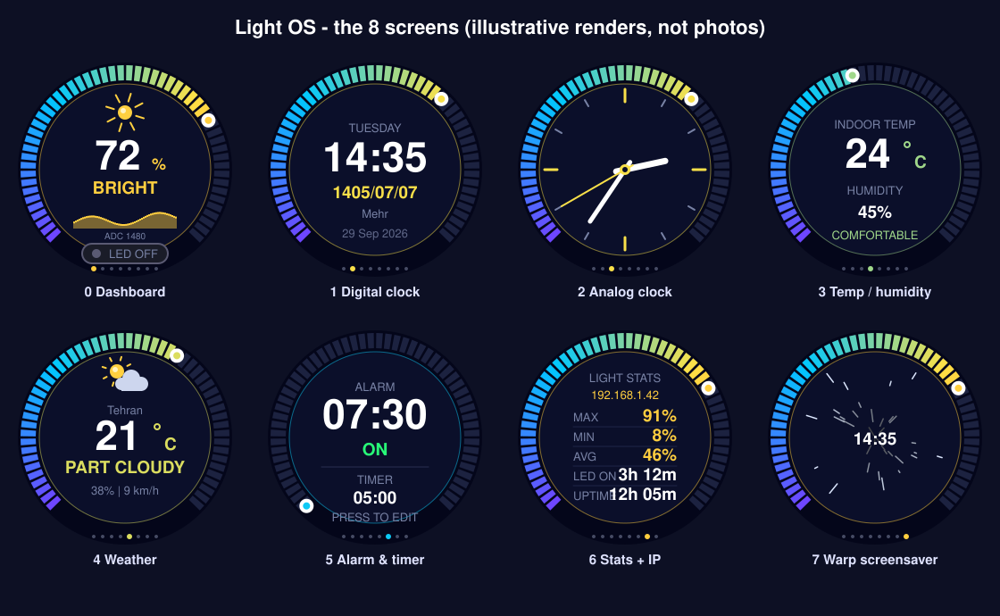

# Light OS - ESP32 Smart Light Dashboard

[](LICENSE)


A smart desk gadget built around an **ESP32** and a **round 240x240 GC9A01 TFT**.
It measures ambient light with an LDR and switches an LED automatically when it gets dark,
shows everything on a smooth animated round dashboard, keeps time (with the **Persian/Jalali calendar**),
shows indoor temperature/humidity and **outdoor weather**, has an **alarm and timer**, and can be
**controlled from your phone** through a built-in web page. Everything is navigated with a single rotary knob.

> Persian documentation: **[README.fa.md](README.fa.md)** (مستندات فارسی)



*The image above is an illustrative render of the 8 screens, not a photo.
Add photos of your own build to `docs/images/` and link them here.*

---

## Table of contents

1. [Features](#features)
2. [Tested configuration](#tested-configuration)
3. [What you need](#what-you-need)
4. [Wiring](#wiring)
5. [Software setup (step by step)](#software-setup-step-by-step)
6. [First boot and opening the phone page](#first-boot-and-opening-the-phone-page)
7. [Using it](#using-it)
8. [Configuration](#configuration)
9. [Repository layout](#repository-layout)
10. [Documentation index](#documentation-index)
11. [Security notes](#security-notes)
12. [Known limitations and ideas](#known-limitations-and-ideas)
13. [Credits and third-party notices](#credits-and-third-party-notices)
14. [Author and contact](#author-and-contact)
15. [License](#license)

---

## Features

**Light sensing and LED**
- Averaged LDR readings shown as a 0-100 % light level.
- Automatic LED with **hysteresis and a hold time** (no flicker): LED turns on when it stays dark for 1.4 s and off when it stays bright for 1.4 s.
- Manual override from the phone: Auto / Always on / Always off.
- Adjustable dark/bright thresholds (from the phone), saved in flash.
- Beep patterns: 2 beeps when the LED turns on, 1 beep when it turns off (can be muted).

**Round display UI (8 pages, flicker-free)**
- Segmented gradient ring gauge around the edge, animated sun/moon icon, live history graph, LED status pill, ripple effect on changes.
- Pages: Dashboard, Digital clock, Analog clock, Indoor temperature/humidity, Weather, Alarm and timer, Stats (with IP address), Warp screensaver.
- Background tint smoothly follows the ambient light (night blue to warm day tone).

**Time and date**
- Time from the internet (NTP) - no RTC module needed. Default timezone: Iran (UTC+3:30, no DST); easy to change.
- **Jalali (Persian) date** next to the Gregorian date.

**Environment**
- Indoor temperature and humidity with a DHT11 (with a "comfort" label).
- Outdoor weather from [Open-Meteo](https://open-meteo.com) (no API key): temperature, condition icon, humidity, wind. City chosen from the phone page.

**Alarm and timer**
- Daily alarm and a countdown timer (1-99 min), editable on the device with the knob **or** from the phone.
- Full-screen flashing overlay + repeating beeps; dismiss with the knob or the phone.

**Phone control (built-in web server)**
- Open `http://lightos.local` (or the device IP) on the same Wi-Fi.
- Live gauge, temperature, humidity, time, LED state; switch LED mode, change page, set alarm/timer, pick the weather city, tune thresholds, toggle auto-cycle and beeps.
- The UI is **bilingual - English and Persian (فارسی)** with a language switch button (saved in your browser; right-to-left layout for Persian), mobile-first, and needs no internet or external libraries.
- Also a small JSON API - see [docs/web-api.md](docs/web-api.md).

**Smart idle mode**
- After 1 minute with no light change and no knob use, the display auto-cycles through Clock, Climate, Weather, Analog, Stats and Warp pages.
- A sudden light change, LED change, knob action, alarm or phone action wakes it back to the dashboard.

**Persistent settings**
- Thresholds, LED mode, alarm, timer, beeps, auto-cycle and weather location survive power loss (stored in flash, written with debouncing to reduce wear).

---

## Tested configuration

This project was built and **tested on real hardware** (full firmware and both example sketches ran without problems):

| Item | Used for testing |
|---|---|
| Board | **ESP32 DevKit, 38-pin**, ESP32-D chip, **CP210x** (CP2102) USB-to-serial |
| Display | GC9A01 1.28" round TFT, 240x240, 7-pin SPI module |
| Sensors / parts | LDR + 10 kOhm, LED + 220 ohm, active buzzer, KY-040 encoder, DHT11 module |
| Computer / IDE | Windows, Arduino IDE 2.x |
| ESP32 board package | Espressif **esp32** from Boards Manager (exact version was not recorded) |
| Libraries | **Latest releases** available in the Library Manager at the time of testing (September 2026): Adafruit GFX Library, Adafruit GC9A01A (the manager offered 1.1.1), DHT sensor library |
| Sketches tested | `light_os` (main firmware), `hardware_selftest`, `wifi_time_test` |

Other ESP32 DevKit boards (30-pin) should work with the same GPIO numbers, but they have not been tested. If a newer library or board-package release ever breaks
compilation, please open an issue with the versions you use.

---

## What you need

| Qty | Part | Notes |
|---|---|---|
| 1 | ESP32 DevKit board (ESP32-WROOM-32 family) | Tested on a **38-pin DevKit with a CP2102 USB chip**. 30-pin boards should also work (same GPIO numbers) but are untested; pin labels may differ slightly between vendors |
| 1 | GC9A01 1.28" round TFT, 240x240, SPI | 7-pin module: RST, CS, DC, SDA, SCL, GND, VCC |
| 1 | LDR (photoresistor) | e.g. GL5528 |
| 1 | 10 kOhm resistor | LDR voltage divider |
| 1 | LED (any colour) + 220 Ohm resistor | |
| 1 | Active buzzer (3.3-5 V) | Active type: beeps when powered, no tone generation needed |
| 1 | KY-040 rotary encoder module | 5 pins: CLK, DT, SW, +, GND |
| 1 | DHT11 module (3-pin) | 3-pin module with pull-up resistor onboard |
| - | Breadboard(s), jumper wires, USB data cable | |

Full list with notes and optional parts: **[docs/bom.md](docs/bom.md)**.

---

## Wiring

**Everything is powered from the ESP32 `3V3` pin. Do not connect any module to 5V.**

| Function | Device pin | ESP32 GPIO |
|---|---|---|
| Display SCL (SPI clock) | SCL | **18** |
| Display SDA (SPI MOSI) | SDA | **23** |
| Display chip select | CS | **5** |
| Display data/command | DC | **2** |
| Display reset | RST | **15** |
| Display power | VCC / GND | 3V3 / GND |
| Light sensor (divider midpoint) | LDR + 10 kOhm | **34** |
| LED (anode via 220 Ohm to GND) | LED | **16** |
| Buzzer (+) | Buzzer | **17** |
| Knob clock | CLK | **32** |
| Knob data | DT | **33** |
| Knob button | SW | **25** |
| Knob power | + / GND | 3V3 / GND |
| DHT11 data | S / OUT | **27** |
| DHT11 power | VCC / GND | 3V3 / GND |


Detailed step-by-step wiring, per-module diagrams, breadboard tips and the reasoning
behind each pin choice: **[docs/wiring.md](docs/wiring.md)**.

> Tip: run the [hardware self-test](firmware/examples/hardware_selftest/hardware_selftest.ino)
> first. It checks the display, LED, buzzer, LDR, DHT11 and knob one by one.

---

## Software setup (step by step)

### 1. Install Arduino IDE and the ESP32 board package
1. Install **Arduino IDE 2.x** from <https://www.arduino.cc/en/software>.
2. Open *File -> Preferences* and add this URL to **Additional boards manager URLs**:
   `https://espressif.github.io/arduino-esp32/package_esp32_index.json`
3. Open *Tools -> Board -> Boards Manager*, search **esp32** (by Espressif Systems) and install it.
4. Select the board: *Tools -> Board -> esp32 -> **ESP32 Dev Module***.

### 2. Install the libraries
Open *Tools -> Manage Libraries* and install:

| Library | Author |
|---|---|
| **Adafruit GFX Library** | Adafruit |
| **Adafruit GC9A01A** | Adafruit |
| **DHT sensor library** | Adafruit |
| Adafruit BusIO, Adafruit Unified Sensor | Adafruit (installed as dependencies - accept the prompt) |

Wi-Fi, HTTP client, web server, mDNS, Preferences and time support are **built into the ESP32 board package**.
More details (and what to do if the installer complains about a missing `libraries` folder): [docs/libraries.md](docs/libraries.md).

### 3. Get the code
```bash
git clone https://github.com/mehrdad2200/LightOS-ESP32.git
```
(or click **Code -> Download ZIP** on GitHub and extract it).

### 4. Add your Wi-Fi details
Inside `firmware/light_os/`:
1. Copy `secrets.h.example` and rename the copy to **`secrets.h`**.
2. Edit it:
   ```cpp
   const char *WIFI_SSID = "YOUR_WIFI_NAME";
   const char *WIFI_PASS = "YOUR_WIFI_PASSWORD";
   ```
`secrets.h` is in `.gitignore`, so your password is never committed. The ESP32 supports **2.4 GHz** Wi-Fi only.

### 5. (Optional) Set your timezone and city
The defaults are Iran time and Tehran weather. Both can be changed later - the city from the phone page,
the timezone in the code ([docs/configuration.md](docs/configuration.md)).

### 6. Upload
1. Open `firmware/light_os/light_os.ino` (the folder name must match the file name - it does).
2. Connect the ESP32 with a **data** USB cable and pick the port under *Tools -> Port*.
3. If you get "Sketch too big", choose *Tools -> Partition Scheme -> **Huge APP (3MB No OTA/1MB SPIFFS)***.
4. Click **Upload**. If the IDE waits at "Connecting...", hold the board's **BOOT** button until upload starts.
5. Open *Tools -> Serial Monitor* at **115200 baud**.

---

## First boot and opening the phone page

1. A short start-up animation plays, then the dashboard appears.
2. The Serial Monitor prints the address, e.g.
   `Web control: http://192.168.1.42  (or http://lightos.local)`.
   The same IP is also shown on the **Stats** page of the display (page 6).
3. Connect your phone to the **same Wi-Fi** and open that address in the browser.
4. The clock shows *SYNCING* for a few seconds until the time arrives from the internet.
5. The weather page shows *LOADING...* until the first download succeeds.

`lightos.local` works on most iPhones and PCs; some Android phones cannot resolve `.local` names - use the IP address there.

---

## Using it

| Knob action | Result |
|---|---|
| **Rotate** | Next / previous page |
| **Short press** | Back to the dashboard (on the Alarm page: step through the edit fields) |
| **Long press** (0.7 s) | Back to the dashboard, cancel editing, or stop a ringing alarm |
| Any press while ringing | Stops the alarm / timer |

Setting the alarm on the device: go to the **Alarm and timer** page (5), short-press to start editing,
turn the knob to change the value, short-press to move to the next field (hour -> minute -> alarm on/off ->
timer minutes -> start/stop timer). Full guide with every page explained: **[docs/usage.md](docs/usage.md)**.

---

## Configuration

Most tunables are constants at the top of `light_os.ino` (idle time, wake sensitivity, ADC range,
weather refresh interval, knob direction, pins). Thresholds, alarm, LED mode, etc. are changed at runtime from
the phone or knob and saved automatically. See **[docs/configuration.md](docs/configuration.md)**, including a
short calibration procedure for your own LDR.

---

## Repository layout

```
LightOS-ESP32/
+-- README.md                    <- you are here
+-- README.fa.md                 <- Persian documentation
+-- LICENSE                      <- MIT
+-- CHANGELOG.md
+-- CONTRIBUTING.md
+-- THIRD_PARTY.md               <- libraries, data sources, notices
+-- docs/
|   +-- wiring.md                <- detailed wiring guide
|   +-- bom.md                   <- parts list
|   +-- libraries.md             <- libraries and board package
|   +-- usage.md                 <- user guide for every page and control
|   +-- configuration.md         <- all settings and calibration
|   +-- web-api.md               <- HTTP/JSON API
|   +-- architecture.md          <- how the firmware works
|   +-- troubleshooting.md       <- problems and fixes
|   +-- images/
|       +-- schematic.svg        <- circuit schematic
|       +-- screens.svg          <- illustration of the 8 screens
+-- firmware/
|   +-- light_os/
|   |   +-- light_os.ino         <- the main firmware
|   |   +-- secrets.h.example    <- copy to secrets.h and edit
|   +-- examples/
|       +-- hardware_selftest/   <- test every part before the main firmware
|       +-- wifi_time_test/      <- test Wi-Fi + internet time only
+-- .github/ISSUE_TEMPLATE/      <- bug report / feature request templates
```

---

## Documentation index

| Document | What is inside |
|---|---|
| [docs/wiring.md](docs/wiring.md) | Pin table, per-module wiring, breadboard layout, assembly order, changing pins |
| [docs/bom.md](docs/bom.md) | Parts list, alternatives, optional parts |
| [docs/libraries.md](docs/libraries.md) | Board package, libraries, manual install, versions |
| [docs/usage.md](docs/usage.md) | Every page, knob controls, alarm/timer, idle mode, phone UI |
| [docs/configuration.md](docs/configuration.md) | All constants, timezone, calibration, translating the web UI |
| [docs/web-api.md](docs/web-api.md) | Endpoints, parameters, JSON format, curl examples |
| [docs/architecture.md](docs/architecture.md) | Rendering, threading, storage, algorithms |
| [docs/troubleshooting.md](docs/troubleshooting.md) | Symptom -> cause -> fix table |

---

## Security notes

- The web server has **no password**. Anyone on your Wi-Fi network can open the page and control the device.
  Use it on a network you trust and **never forward port 80 from your router to the internet**.
- The weather request uses HTTPS with certificate checking disabled (`setInsecure()`), which is common on microcontrollers
  but means the server identity is not verified. No private data is sent (only the latitude/longitude of your chosen city).
- Wi-Fi credentials are kept in `secrets.h` (git-ignored). Do not paste them into issues or screenshots.

---

## Known limitations and ideas

- No battery-backed clock: after power loss the time is unknown until Wi-Fi reconnects.
- DHT11 accuracy is about +/-2 degrees C and +/-5 % RH (a DHT22 or BME280 would be better - PRs welcome).
- Statistics (max/min/average, LED-on time) reset on reboot.
- Weather depends on `api.open-meteo.com` being reachable from your network.

Ideas: OTA firmware updates, web page password, MQTT / Home Assistant integration, RTC module support,
more weather details (forecast), 3D-printed enclosure.

---

## Credits and third-party notices

- Weather data by **[Open-Meteo.com](https://open-meteo.com/)** (CC BY 4.0, free for non-commercial use).
- Built on the Adafruit GFX / GC9A01A / DHT libraries and the Espressif Arduino-ESP32 core - see [THIRD_PARTY.md](THIRD_PARTY.md).
- The Gregorian to Jalali conversion is based on the widely used public algorithm.

## Author and contact

Created by **mehrdadFreegan** - GitHub: [@mehrdad2200](https://github.com/mehrdad2200)

- Email: mehrdad2200@gmail.com
- Telegram channel: tm.favme

For questions and bug reports please **open an issue** on GitHub so that everyone can benefit from the answer
(see [CONTRIBUTING.md](CONTRIBUTING.md)). For security matters see [SECURITY.md](SECURITY.md).

## License

Released under the [MIT License](LICENSE).
