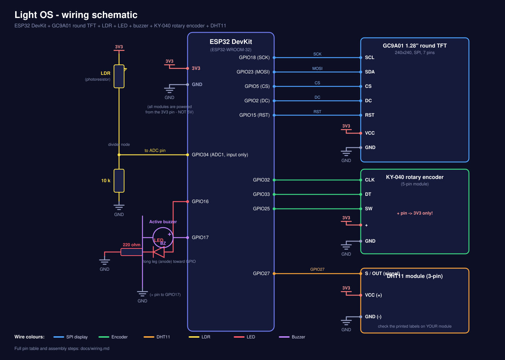

# Wiring guide

This page contains everything about connecting the parts: the full pin table, a diagram for every module,
breadboard tips, a safe assembly order and the reasoning behind each pin. The circuit schematic is
[`images/schematic.svg`](images/schematic.svg).



---

## 0. Before you start (read this)

- **Disconnect USB while wiring.** Change wires only when the board is unpowered.
- **Everything runs from the `3V3` pin.** Do **not** power the display, the knob or the DHT11 from `5V`/`VIN`.
  Especially the KY-040: its `+` pin feeds pull-up resistors, so at 5 V the signal pins would send 5 V into the ESP32 inputs.
- **Common ground:** every module's GND must be connected to an ESP32 GND pin.
- **Read the printed labels on your modules.** DHT11 and KY-040 boards from different sellers can order their pins differently.
  Reversing `+` and `-` on the DHT11 can destroy it.
- Keep the SPI wires to the display short (ideally under 20 cm) and away from the buzzer/LED wires.

---

## 1. Master pin table

| # | Function | Module pin | ESP32 pin | Direction | Notes |
|---|---|---|---|---|---|
| 1 | Display SPI clock | SCL | **GPIO18** | out | hardware SPI (VSPI) SCK |
| 2 | Display SPI data | SDA | **GPIO23** | out | hardware SPI (VSPI) MOSI. "SDA/SCL" here are SPI names, **not** I2C |
| 3 | Display chip select | CS | **GPIO5** | out | |
| 4 | Display data/command | DC | **GPIO2** | out | strapping pin - see section 8 |
| 5 | Display reset | RST | **GPIO15** | out | strapping pin - see section 8 |
| 6 | Display power | VCC | 3V3 | - | 3.3 V |
| 7 | Display ground | GND | GND | - | |
| 8 | Light sensor | divider midpoint | **GPIO34** | in (analog) | ADC1 channel, input only |
| 9 | LED | via 220 ohm | **GPIO16** | out | |
| 10 | Buzzer | + | **GPIO17** | out | active buzzer |
| 11 | Knob clock | CLK | **GPIO32** | in | interrupt driven |
| 12 | Knob data | DT | **GPIO33** | in | interrupt driven |
| 13 | Knob button | SW | **GPIO25** | in | active low |
| 14 | Knob power | + | 3V3 | - | **3V3 only** |
| 15 | DHT11 data | S / OUT | **GPIO27** | in/out | |
| 16 | DHT11 power | VCC / + | 3V3 | - | |
| 17 | All grounds | GND / - | GND | - | |

GPIOs not used by the project (free for your extensions): 4, 12*, 13, 14, 19, 21, 22, 26, 35, 36, 39
(*GPIO12 is a strapping pin - avoid it for anything that pulls it high at boot).
GPIO 6-11 are connected to the flash memory and must never be used. GPIO 1 and 3 are the USB serial port.

---

## 2. Power distribution

The ESP32 has one `3V3` pin and several `GND` pins. Feed them into the two power rails of your breadboard:

```
ESP32 3V3 ------------------------------> [ + rail ]  (red)   -> display VCC, knob +, DHT11 VCC, LDR top
ESP32 GND ------------------------------> [ - rail ]  (blue)  -> display GND, knob GND, DHT11 GND,
                                                                 10k resistor, LED resistor, buzzer -
```

Powering the board: USB. If the board resets randomly (brown-out) when Wi-Fi is active, use a better
USB cable/port - see [troubleshooting.md](troubleshooting.md).

---

## 3. Round display (GC9A01, 7 pins)

```
 Display module            ESP32
 ----------------------------------------
  RST   (pin 1)  ------->  GPIO15
  CS    (pin 2)  ------->  GPIO5
  DC    (pin 3)  ------->  GPIO2
  SDA   (pin 4)  ------->  GPIO23   (SPI data / MOSI)
  SCL   (pin 5)  ------->  GPIO18   (SPI clock / SCK)
  GND   (pin 6)  ------->  GND
  VCC   (pin 7)  ------->  3V3
```

- The pin order above is the order on the module used to develop this project. **Match by the printed names, not by position.**
- This display has **no backlight pin** in the 7-pin version, so the screen brightness cannot be changed in software.
- If the display shows only a white screen or garbage, see [troubleshooting.md](troubleshooting.md).

---

## 4. Light sensor (LDR + 10 kOhm voltage divider)

```
   3V3
    |
   [ LDR ]        <- photoresistor: resistance DROPS when it gets brighter
    |
    +-----------------------> GPIO34   (measurement point)
    |
  [ 10 kOhm ]
    |
   GND
```

How it works: the LDR and the resistor split 3.3 V. In bright light the LDR has low resistance, so the midpoint
voltage is high and the ADC value goes **up**; in the dark it goes **down**. The firmware expects this direction
(bright = high value). If you swap the LDR and the resistor, the readings invert and the LED logic will be backwards.

GPIO34 belongs to ADC1. This matters: **ADC2 pins cannot be read while Wi-Fi is on**, so the sensor must stay on an ADC1 pin
(GPIO 32-39). The LDR polarity does not matter (it has no + or -).

---

## 5. LED

```
GPIO16 ----> LED anode (long leg)
             LED cathode (short leg, flat side) ----> 220 ohm ----> GND
```

- The resistor can be on either side of the LED; it must be in series.
- With 3.3 V and 220 ohm the current is only a few mA - safe for the GPIO.
- If the LED never lights, it is probably reversed.

---

## 6. Buzzer

```
GPIO17 ----> buzzer "+" (marked pin, usually the longer leg)
GND    ----> buzzer "-"
```

Use an **active buzzer** (it makes its own tone when powered). A passive buzzer would only click.
Small active buzzers can be driven directly from the GPIO. If your buzzer is large/loud (draws more than a few tens of mA),
drive it through a transistor instead:

```
GPIO17 ---[ 1 kOhm ]---> base of NPN transistor (2N2222 / BC547)
                         emitter -> GND
                         collector -> buzzer "-"
buzzer "+" -> 3V3   (or 5V only if the buzzer needs it - the transistor isolates the ESP32 pin)
```
(Add a small diode across an inductive buzzer if you see resets: cathode to +, anode to -.)

---

## 6b. Rotary encoder (KY-040, 5 pins)

```
 KY-040        ESP32
 -----------------------------
  CLK   ---->  GPIO32
  DT    ---->  GPIO33
  SW    ---->  GPIO25
  +     ---->  3V3       (NOT 5V)
  GND   ---->  GND
```

- The module has its own pull-up resistors to `+`; the firmware also enables the ESP32 internal pull-ups.
- Rotation is decoded in an interrupt routine with a state table, so fast turns are not missed and contact bounce is filtered.
- If turning **clockwise goes to the previous page**, set `ENC_REVERSE = true` in the sketch (no rewiring needed).

---

## 7. DHT11 (3-pin module)

```
 DHT11 module     ESP32
 -----------------------------
  S / OUT / DATA  ---->  GPIO27
  VCC / +  (middle) ->   3V3
  GND / -          ->    GND
```

- Most 3-pin DHT11 modules already include the required pull-up resistor. A bare 4-pin DHT11 needs a 10 kOhm resistor from DATA to VCC.
- Pin order differs between manufacturers: **check the silkscreen** (S, +, - or OUT, VCC, GND).
- The DHT11 is slow: the firmware reads it every 3 seconds.

---

## 8. Why these pins? (and what you can change)

| Pin | Reason |
|---|---|
| 18, 23, 5 | Default hardware SPI (VSPI) pins: fast display updates |
| 2, 15 | Free pins for the display's DC/RST. They are *strapping pins* (sampled at reset). This design works on the tested board, but on some boards a display wired to them can interfere with flashing/boot. **If upload fails with the display attached, unplug the DC (GPIO2) wire while uploading, then reconnect it.** Alternatively move DC/RST to other free pins (e.g. 4 and 13) and change the `#define`s. |
| 34 | ADC1, input-only, works while Wi-Fi is active |
| 32, 33 | Normal inputs with internal pull-ups, ideal for the encoder interrupts |
| 25, 27 | Normal digital I/O (they are ADC2 pins, which is fine because they are used digitally) |
| 16, 17 | Free outputs, no boot-time function (on classic ESP32 boards without PSRAM) |

Changing pins: edit the `#define`s near the top of `light_os.ino`. Rules:
1. The LDR must be on an ADC1 pin (32, 33, 34, 35, 36, 39).
2. GPIO34-39 are input-only: they cannot drive the LED/buzzer/display.
3. Never use GPIO 6-11.
4. The encoder CLK/DT pins need interrupt support (all normal GPIOs have it).
5. If you change the display's SCL/SDA pins, keep them consistent with the `SPI.begin(...)` call.

Boards with PSRAM (ESP32-WROVER) use GPIO16/17 internally - avoid those two pins there.

---

## 9. Suggested assembly and test order

Build in stages so any mistake is easy to find. The [hardware self-test](../firmware/examples/hardware_selftest/hardware_selftest.ino)
shows live readings for everything and can be run after each stage.

1. **ESP32 alone** - upload the self-test; check that the Serial Monitor prints text.
2. **Display** - wire the 7 pins. Run the self-test: the screen should flash red, green, blue, white.
3. **LED and buzzer** - the self-test blinks the LED 3 times and beeps twice.
4. **LDR** - the `LDR:` value on screen/Serial should change when you cover the sensor with your hand (high in light, low in shadow).
5. **DHT11** - `DHT:` should show temperature and humidity within about 3 seconds ("NO DATA" means a wiring or pin-order problem).
6. **Knob** - `KNOB:` counts up/down when turned and `BUTTON: DOWN` shows while pressed.
7. Upload the main firmware (`light_os.ino`).

---

## 10. Breadboard layout suggestion

```
 [ + rail ] ==================================================  (3V3)
 [ - rail ] ==================================================  (GND)

   +--------------------+
   |   ESP32 DevKit     |   left side pins    right side pins
   |                    |   (labels vary by board - use the GPIO numbers printed on it)
   +--------------------+

 Left area (analog / outputs)        Right area (display + knob + DHT)
   LDR + 10k divider  -> GPIO34        Display: 7 wires (18,23,5,2,15 + 3V3/GND)
   LED + 220 ohm      -> GPIO16        Knob:    CLK 32, DT 33, SW 25, + 3V3, GND
   Buzzer             -> GPIO17        DHT11:   data 27, 3V3, GND
```

Practical tips:
- Use different wire colours per group (see the legend in the schematic).
- Put the display's 7 wires in one neat bundle and keep them short.
- Dupont female-to-female wires plug directly into the display/knob/DHT11 pin headers.
- Before powering, check with a multimeter (continuity mode) that **3V3 and GND are not connected to each other**.

---

## 11. Final checklist

- [ ] No module is connected to 5V/VIN
- [ ] 3V3 rail and GND rail are not shorted together
- [ ] Every module's GND goes to the GND rail
- [ ] Display pins match by **name** (RST, CS, DC, SDA, SCL)
- [ ] LDR divider midpoint goes to GPIO34 (not GPIO4)
- [ ] LED polarity correct, resistor in series
- [ ] Buzzer is an active one, + to GPIO17
- [ ] Knob `+` on 3V3
- [ ] DHT11 `+`/`-` not reversed
